# [TF 2.x] PaDiM - Anomaly Detection Localization

This repository contains an unofficial PaDiM implementation using tensorflow. 

## Paper
PaDiM: a patch distribution modeling framework for anomaly detection and localization. 
\[[Link](https://arxiv.org/pdf/2011.08785.pdf)]

## Dependencies
* Windows 10, Python 3.8.8, Tensorflow 2.4.1 GPU
* Scikit-learn, Scikit-image, Matplotlib

## Run
```
# options: seed, rd, target, batch_size, is_plot, net
python main.py
```

## Dataset
[MVTecAD dataset](https://mvtec.com/company/research/datasets/mvtec-ad/)

## Results (AU ROC)
### Implementation results on MVTec
* Network Type:
    - PyTorch.: WideResNet50, Rd 550 
    (from [PyTorch version](https://github.com/xiahaifeng1995/PaDiM-Anomaly-Detection-Localization-master)) (WR50-Rd550)
    - Net 1: EfficientNetB7 \[layer a_expand_activation 5, 6, 7], Rd 1000 (ENB7-Rd1000)
    - Net 2: EfficientNetB7 \[layer a_expand_activation 4, 6, 7], Rd 1000 (ENB7-Rd1000)
    - Net 3: EfficientNetB7 \[layer a_activation 5, 6, 7], Rd 1000 (ENB7-Rd1000)

* I observed that intermediate layers selection has some effects on detection performance.
* Besides, a high image-level au-roc does not guarantee a high level of au-roc on patch-level. 

MvTec       	|PyTorch (Img)  |Net 1 (Img)|   	 Net 2 (Img)|   	Net 3 (Img)|
-----       	| -----         |-----  |       	 ----- |        	 ----- |        
carpet      	|0.999|	0.950|	0.982|	0.996|
grid        	|0.957|	0.936|	0.971|	0.976|
leather     	|1.000|	0.999|	1.000|	1.000|
tile        	|0.974|	0.957|	0.984|	0.981|
wood        	|0.988|	0.948|	0.954|	0.990|
bottle      	|0.998|	0.983|	0.996|	0.999|
cable       	|0.922|	0.909|	0.919|	0.973|
capsule     	|0.915|	0.946|	0.953|	0.958|
hazelnut    	|0.933| 0.983|	0.973|	0.997|
metal_nut   	|0.992|	0.869|	0.930|	0.931|
pill        	|0.944|	0.882|	0.879|	0.925|
screw       	|0.844|	0.632|	0.767|	0.895|
toothbrush  	|0.972|	0.767|	0.972|	0.811|
transistor  	|0.978|	0.930|	0.949|	0.975|
zipper      	|0.909|	0.980|	0.986|	0.990|
**Avg. (tex.)** 	|**0.9840**|	**0.9579**|	**0.9781**|	**0.9885**|
**Avg. (obj.)** 	|**0.9410**|	**0.8881**|	**0.9323**|	**0.9455**|
**Avg. (all)**  	|**0.9550**|	**0.9114**|	**0.9476**|	**0.9598**|

MvTec       	|org. (Patch)  	 |Net 1 (Patch) 	 |Net 2 (Patch) 	|Net 3(Patch)
-----       	|-----         	 |-----         	| -----         	 |-----         
carpet      	|0.990	|0.973	|0.854	|0.829|
grid        	|0.965	|0.958	|0.750	|0.768|
leather     	|0.989	|0.986	|0.902	|0.831|
tile        	|0.939	|0.905	|0.729	|0.748|
wood        	|0.941	|0.946	|0.831	|0.814|
bottle      	|0.982	|0.971	|0.861	|0.831|
cable       	|0.968	|0.963	|0.815	|0.843|
capsule     	|0.986	|0.977	|0.940	|0.911|
hazelnut    	|0.979	|0.965	|0.876	|0.834|
metal_nut   	|0.971	|0.986	|0.926	|0.926|
pill        	|0.961	|0.955	|0.893	|0.903|
screw       	|0.983	|0.986	|0.941	|0.893|
toothbrush  	|0.983	|0.979	|0.937	|0.864|
transistor  	|0.987	|0.977	|0.958	|0.958|
zipper      	|0.975	|0.965	|0.840	|0.814|
**Avg. (tex.)** 	|**0.9650**	|**0.9536**	|**0.8131**	|**0.7979**|
**Avg. (obj.)** 	|**0.9780**	|**0.9724**	|**0.8987**	|**0.8776**|
**Avg. (all)**  	|**0.9730**	|**0.9661**	|**0.8702**	|**0.8510**|


#### ROC Curve (Net 1) Bottle


#### PR Curve (Net 1) Bottle
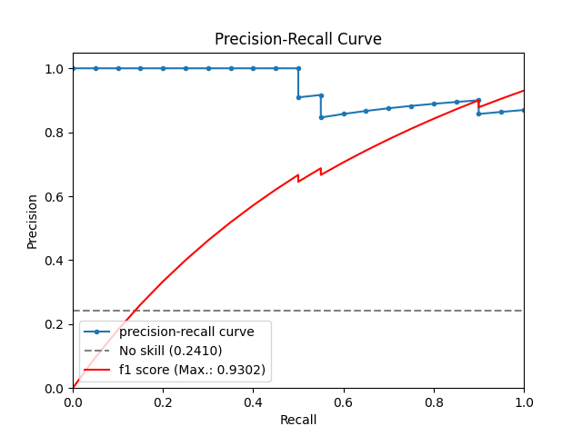

#### Localization examples (Net 1) (cherry-picked)
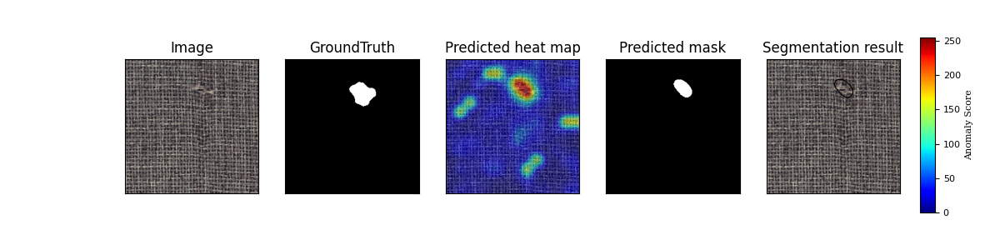
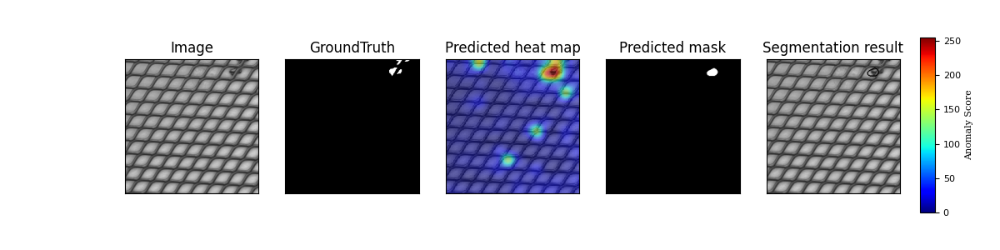
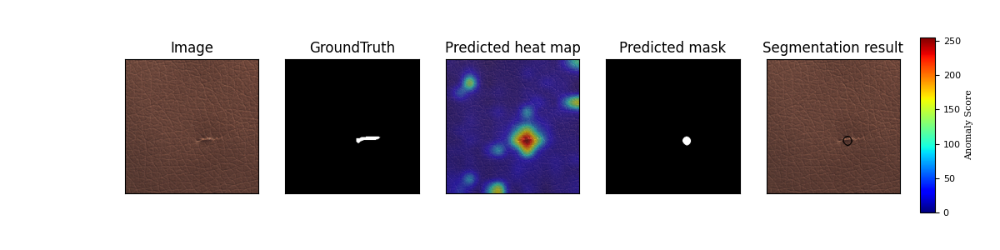
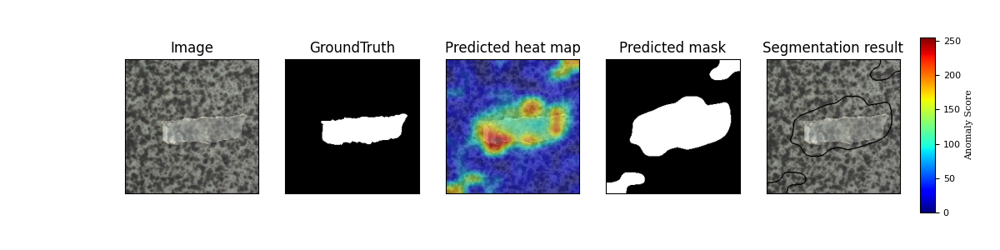
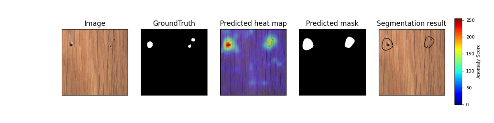
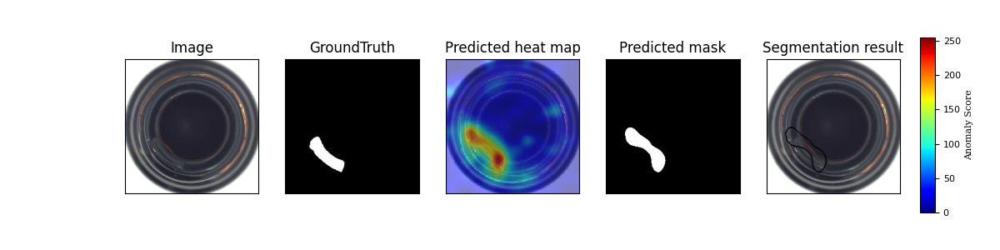
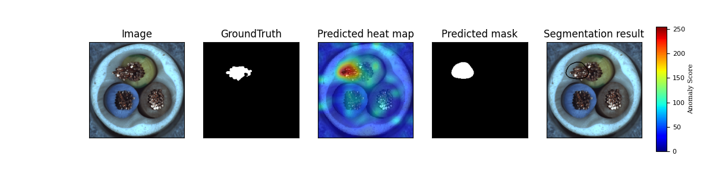
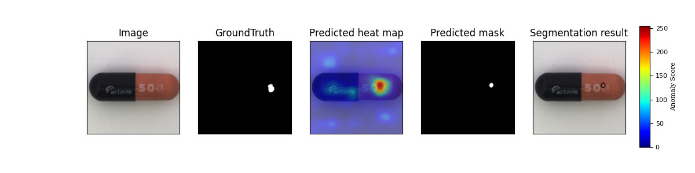
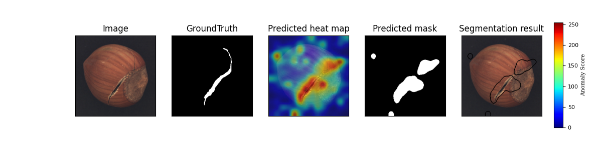
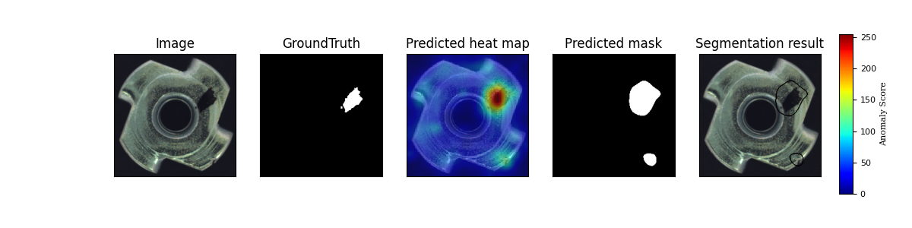
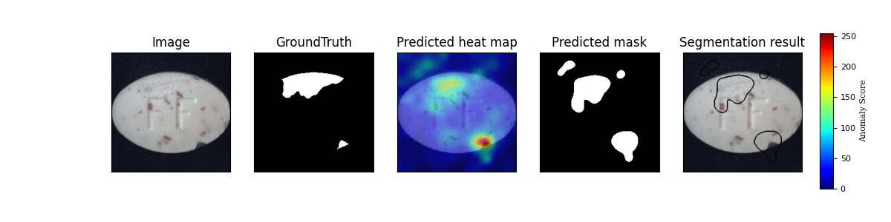
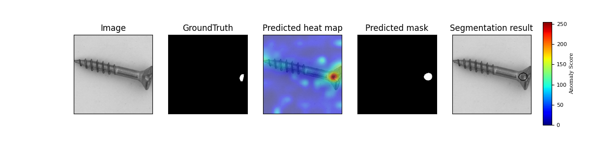
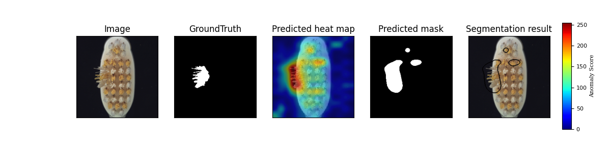
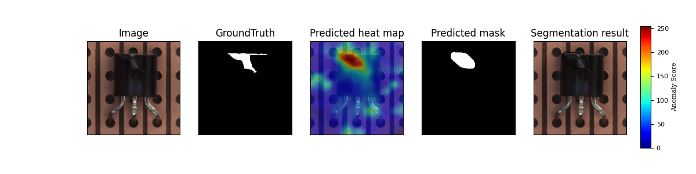
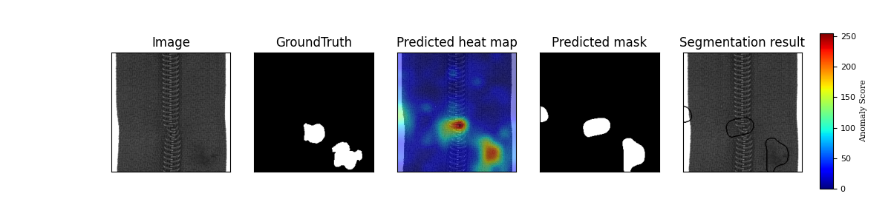
